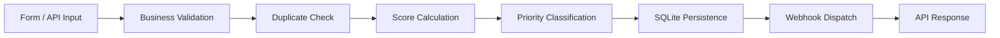
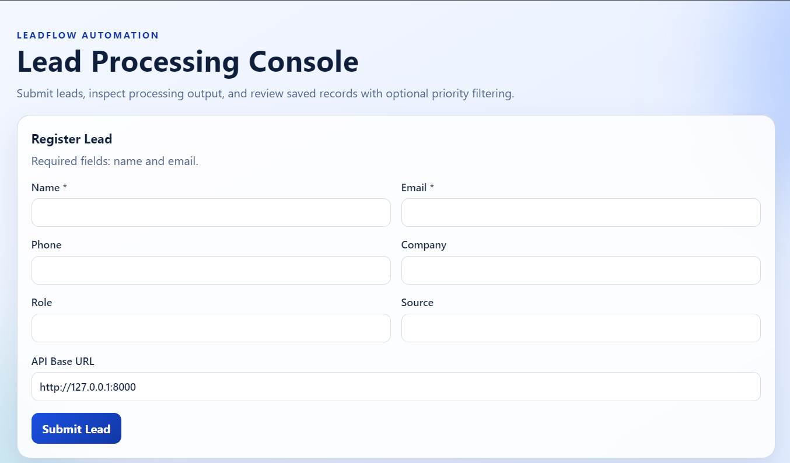
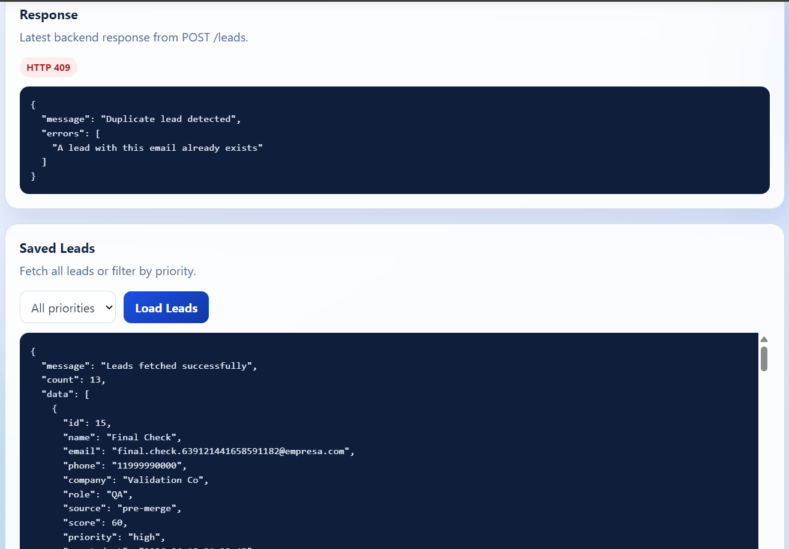

# Leadflow Automation

Leadflow Automation is a portfolio-focused project that demonstrates how to build a reliable lead processing pipeline with clear architecture, practical validation rules, and resilient integrations.

## Overview
This project receives leads from form/API input, validates business rules, prevents duplicates, computes qualification score and priority, persists data in SQLite, and attempts webhook delivery without losing the saved lead.

## Problem Solved
Sales and operations teams often collect leads from multiple channels but process them manually or inconsistently.  
This project solves that by standardizing the full lead lifecycle in a single API workflow:
- Input normalization and validation
- Duplicate protection
- Objective lead scoring and prioritization
- Reliable persistence first, external webhook second
- Operational visibility through logs

## Proposed Solution
The solution uses a layered FastAPI design where each responsibility lives in a dedicated service:
- Business validation
- Duplicate lookup
- Score calculation
- Priority classification
- Repository persistence
- Webhook dispatch

This keeps route handlers thin and the system easy to evolve.

## Architecture At A Glance
- `FastAPI` for API and request orchestration.
- `SQLite` for local persistence (`data/leadflow.db`).
- Service layer for business rules and integrations.
- Structured file logging (`logs/app.log`).
- Simple frontend served by the same app (`/`) for local portfolio demos.

## Automation Flow



## Key Features
- Health check endpoint.
- Lead processing endpoint (`POST /leads`) with:
  - structural validation (FastAPI/Pydantic)
  - business validation
  - case-insensitive duplicate detection by email
  - score and priority calculation
  - SQLite persistence
  - webhook result status (`sent`, `failed`, `skipped`)
- Lead listing endpoint (`GET /leads`) ordered from newest to oldest.
- Optional priority filter (`GET /leads?priority=high`).
- Limited cross-origin handling on `/leads` (`GET`, `POST`, `OPTIONS`) for local frontend testing.
- Basic automated API coverage for core flows (`tests/test_leads.py`).

## Portfolio Differentiators
- Separation of concerns with route orchestration and service-specific logic.
- Failure-tolerant webhook behavior: integration errors do not lose persisted leads.
- Reproducible local setup with `.env.example`.
- Clear, testable business flow with automated baseline coverage.

## Tech Stack
- Backend: Python + FastAPI
- Database: SQLite
- Frontend: HTML + CSS + Vanilla JavaScript
- HTTP client for webhook: Python standard library (`urllib`)
- Logging: Python `logging` + `RotatingFileHandler`
- Tests: `unittest` + FastAPI `TestClient`

## Project Structure
```text
leadflow-automation/
+-- app/
|   +-- database/
|   |   +-- connection.py
|   |   +-- init_db.py
|   +-- models/
|   |   +-- lead.py
|   +-- routes/
|   |   +-- health.py
|   |   +-- leads.py
|   +-- services/
|   |   +-- lead_dedup_service.py
|   |   +-- lead_priority_service.py
|   |   +-- lead_repository_service.py
|   |   +-- lead_scoring_service.py
|   |   +-- lead_validation_service.py
|   |   +-- webhook_service.py
|   +-- utils/
|   |   +-- logger.py
|   +-- main.py
+-- data/
|   +-- leadflow.db
+-- docs/
|   +-- images/
|       +-- .gitkeep
+-- frontend/
|   +-- index.html
|   +-- styles.css
+-- logs/
|   +-- app.log
+-- tests/
|   +-- test_leads.py
+-- .env.example
+-- requirements.txt
```

## Configuration
To enable webhook integration, set the environment variable:

`LEAD_WEBHOOK_URL=http://your-webhook-url`

If this variable is not set, webhook dispatch is skipped.

For local setup reference, use:
- `.env.example`

## How To Run Locally
### 1. Install dependencies
```bash
python -m pip install -r requirements.txt
```

### 2. Optional: configure webhook URL
```bash
# Linux/macOS
export LEAD_WEBHOOK_URL="http://127.0.0.1:9000/webhook"

# PowerShell
$env:LEAD_WEBHOOK_URL="http://127.0.0.1:9000/webhook"
```

### 3. Run the application
```bash
python -m uvicorn app.main:app --host 127.0.0.1 --port 8000 --reload
```

### 4. Open the app
- Frontend: `http://127.0.0.1:8000`
- Health check: `http://127.0.0.1:8000/health`

## API Endpoints
- `GET /health`  
  Returns service status.

- `POST /leads`  
  Processes a lead and returns `score`, `priority`, and `webhook_status`.

- `GET /leads`  
  Returns leads sorted from most recent to oldest.

- `GET /leads?priority=high`  
  Returns leads filtered by `low`, `medium`, or `high`.

## Lead Qualification Rules
### Scoring
- Corporate email: `+20`
- Phone provided: `+10`
- Company provided: `+20`
- Role provided: `+10`

Public domains treated as non-corporate:
- `gmail.com`
- `hotmail.com`
- `outlook.com`
- `yahoo.com`
- `yahoo.com.br`

### Priority
- `0 to 20` -> `low`
- `21 to 40` -> `medium`
- `41+` -> `high`

## Example Request/Response
### Request
```bash
curl -X POST "http://127.0.0.1:8000/leads" \
  -H "Content-Type: application/json" \
  -d "{\"name\":\"Maria Silva\",\"email\":\"maria@empresa.com\",\"phone\":\"(11) 99999-0000\",\"company\":\"Empresa X\",\"role\":\"Gestora\",\"source\":\"landing-page\"}"
```

### Response (example)
```json
{
  "message": "Lead processed and saved successfully",
  "data": {
    "name": "Maria Silva",
    "email": "maria@empresa.com",
    "phone": "(11) 99999-0000",
    "company": "Empresa X",
    "role": "Gestora",
    "source": "landing-page",
    "score": 60,
    "priority": "high"
  },
  "webhook_status": "sent"
}
```

## Screenshots
### Lead Submission Form


### Leads Listing


## Future Improvements
- Add authentication and role-based access.
- Add pagination and search for `GET /leads`.
- Expand automated tests (edge cases and integration scenarios).
- Add retry queue/dead-letter strategy for webhook delivery.
- Add containerization and CI pipeline for deployment readiness.
