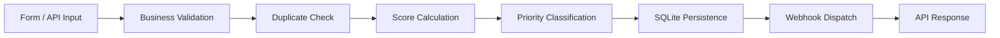

# Leadflow Automation

## Overview
Leadflow Automation is a portfolio-ready backend automation project focused on lead intake, qualification, persistence, and external integration.  
It demonstrates practical software engineering patterns with FastAPI, SQLite, layered services, resilient webhook handling, and a lightweight frontend.

## Problem Solved
Teams often receive leads from different channels but lack a consistent and automated processing pipeline.  
This project solves that by standardizing lead validation, deduplication, scoring, prioritization, storage, and webhook dispatch in one clean flow.

## Solution Architecture
- `FastAPI` for API endpoints and request orchestration.
- Layered services for separated responsibilities:
  - business validation
  - deduplication
  - scoring
  - priority classification
  - repository persistence
  - webhook integration
- `SQLite` for local persistence (`data/leadflow.db`).
- File-based logging (`logs/app.log`) with operational events.
- Simple HTML/CSS frontend for lead submission and lead listing.

## 🔄 Automation Flow



## Main Features
- Health check endpoint.
- Lead intake endpoint (`POST /leads`) with:
  - structural validation (FastAPI/Pydantic)
  - business validation
  - case-insensitive duplicate check
  - score and priority calculation
  - lead persistence in SQLite
  - resilient webhook integration (`sent`, `failed`, `skipped`)
- Lead list endpoint (`GET /leads`) sorted by most recent first.
- Optional lead listing filter: `GET /leads?priority=high`.
- Limited cross-origin handling is implemented on `/leads` (`GET`, `POST`, `OPTIONS`) to support local frontend testing.
- Structured operational logging for the full lead processing lifecycle.

## Tech Stack
- Backend: Python + FastAPI
- Database: SQLite
- Frontend: HTML, CSS, Vanilla JavaScript
- HTTP/Webhook client: Python standard library (`urllib`)
- Logging: Python `logging` + `RotatingFileHandler`

## Project Structure
```text
leadflow-automation/
+-- app/
|   +-- database/
|   |   +-- connection.py
|   |   +-- init_db.py
|   +-- models/
|   |   +-- lead.py
|   +-- routes/
|   |   +-- health.py
|   |   +-- leads.py
|   +-- services/
|   |   +-- lead_dedup_service.py
|   |   +-- lead_priority_service.py
|   |   +-- lead_repository_service.py
|   |   +-- lead_scoring_service.py
|   |   +-- lead_validation_service.py
|   |   +-- webhook_service.py
|   +-- utils/
|   |   +-- logger.py
|   +-- main.py
+-- data/
|   +-- leadflow.db
+-- frontend/
|   +-- index.html
|   +-- styles.css
+-- logs/
|   +-- app.log
+-- requirements.txt
```

## How To Run Locally
### 1. Install dependencies
```bash
python -m pip install -r requirements.txt
```

### 2. Run API
```bash
python -m uvicorn app.main:app --host 127.0.0.1 --port 8000 --reload
```

### 3. Optional: configure webhook URL
```bash
# Linux/macOS
export LEAD_WEBHOOK_URL="http://127.0.0.1:9000/webhook"

# PowerShell
$env:LEAD_WEBHOOK_URL="http://127.0.0.1:9000/webhook"
```

### 4. Run frontend
```bash
python -m http.server 5500 --directory frontend
```
Open: `http://127.0.0.1:5500`

## API Endpoints
- `GET /health`  
  Returns service status.

- `POST /leads`  
  Receives and processes a lead.

- `GET /leads`  
  Lists saved leads from most recent to oldest.

- `GET /leads?priority=high`  
  Lists saved leads filtered by `high`, `medium`, or `low`.

## Lead Scoring Rules
- Corporate email: `+20`
- Phone provided: `+10`
- Company provided: `+20`
- Role provided: `+10`

Public email domains considered non-corporate include:
- `gmail.com`
- `hotmail.com`
- `outlook.com`
- `yahoo.com`
- `yahoo.com.br`

## Priority Rules
- `0 to 20` -> `low`
- `21 to 40` -> `medium`
- `41+` -> `high`

## Example Request/Response
### Request
```bash
curl -X POST "http://127.0.0.1:8000/leads" \
  -H "Content-Type: application/json" \
  -d "{\"name\":\"Maria Silva\",\"email\":\"maria@empresa.com\",\"phone\":\"(11) 99999-0000\",\"company\":\"Empresa X\",\"role\":\"Gestora\",\"source\":\"landing-page\"}"
```

### Response (example)
```json
{
  "message": "Lead processed and saved successfully",
  "data": {
    "name": "Maria Silva",
    "email": "maria@empresa.com",
    "phone": "(11) 99999-0000",
    "company": "Empresa X",
    "role": "Gestora",
    "source": "landing-page",
    "score": 60,
    "priority": "high"
  },
  "webhook_status": "sent"
}
```

## 📸 Screenshots

### Lead Submission Form


### Leads Listing


## Future Improvements
- Add authentication and role-based access.
- Add pagination and search for `GET /leads`.
- Add automated test suite (unit + integration).
- Add retry queue/dead-letter strategy for webhook delivery.
- Add containerization and CI pipeline for deployment readiness.
